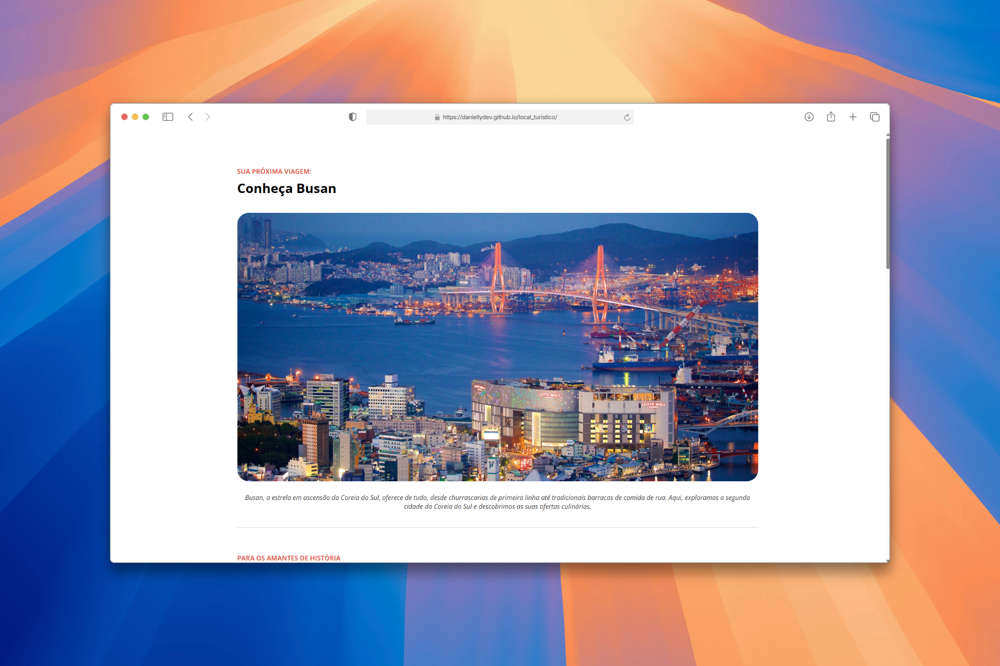

#  Local Turístico

Projeto desenvolvido como parte dos estudos de HTML e CSS, apresentando informações sobre um destino turístico de forma organizada, visual e responsiva.

##  Demonstração

Acesse o projeto online:

🔗 https://daniellydev.github.io/local_turistico/

##  Preview


```md

```

##  Tecnologias Utilizadas

* HTML5
* CSS3
* Git
* GitHub Pages

##  Conceitos Praticados

* Estrutura semântica HTML
* Hierarquia de títulos
* Organização de conteúdo
* Estilização com CSS
* Box Model
* Boas práticas de desenvolvimento web

##  Estrutura do Projeto

```bash
local_turistico/
│
├── index.html
├── style.css
├── assets/
│   ├── images/
│   └── preview.png
└── README.md
```

##  Objetivo

O objetivo deste projeto foi praticar os fundamentos do desenvolvimento web, criando uma página informativa sobre um local turístico, aplicando conceitos de estruturação semântica e estilização com CSS.

##  Como Executar

1. Clone o repositório:

```bash
git clone https://github.com/daniellydev/local_turistico.git
```

2. Acesse a pasta do projeto:

```bash
cd local_turistico
```

3. Abra o arquivo `index.html` no navegador.

##  Autora

Desenvolvido por **Danielly Batista**.

* GitHub: https://github.com/DaniellyDev

##  Licença

Este projeto foi desenvolvido para fins de estudo e aprendizado.
